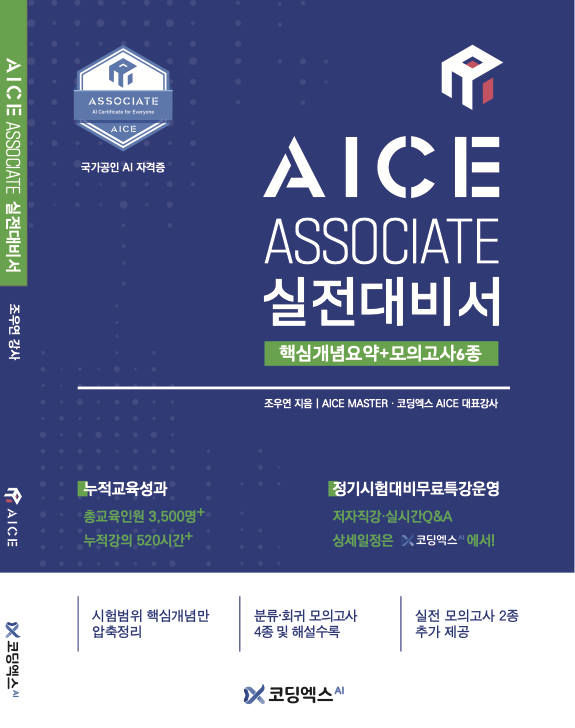
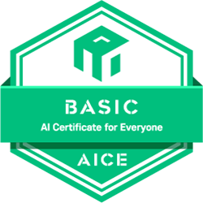

<p align="left">
  <a href="https://codingx.ai/" target="_blank">
    
  </a>
</p> 

## 🚨 [다운로드 전 필독] 모의고사 다운로드 및 압축 파일 암호 안내

> 코딩엑스(CodingX) **「AICE BASIC 실전대비서」** 교재의 실습 코드 및 데이터 저장소입니다.\
> 교재에서 제공되는 **모의고사 4회(해설 포함)** 및 **실전 모의고사 2회(해설 미포함, 문제&정답 파일만 제공)** 의 실습 파일을 제공하며,\
> 모든 자료는 저작권 보호를 위해 🔒 **암호화된 ZIP 형태**로 배포됩니다.

<p align="center">

</p>
<p align="center">
</p>


### 1. 다운로드 방법 (택 1)
* **방법 A (권장):** [파일 다운로드 링크](https://github.com/CodingX-AI/AICE-Basic/releases) 에서 ```v연-월-일.zip``` 파일을 다운로드합니다.
* **방법 B (교재 안내):** 우측 상단 초록색 **[Code]** 버튼 클릭 → **[Download ZIP]** 을 선택하여 전체 파일을 다운로드합니다.
  * *단, 방법 B로 다운로드 시 ```images``` 폴더와 ```README.md``` 파일이 함께 포함될 수 있습니다.*
  
### 2. 🔒 실습 파일 암호 확인  
ZIP 파일 압축을 해제할 때 아래의 교재 인증 암호를 입력해야 실습이 가능합니다.
- **암호 확인**: 본 **교재 40페이지 본문의 좌측 상단 첫 영단어** ( :white_check_mark: **소문자 7글자**, 예: ```0000000```)
  * *보안을 위해 암호는 주기적으로 변경될 수 있으며, 책을 소지하신 독자라면 언제든 해당 페이지에서 확인 가능합니다.*

---

## 📖 교재 특징

1. AICE 시험 범위 **핵심 개념 압축 정리**
2. 분류·회귀 **모의고사 총 6회 제공**

   * 해설 포함 모의고사 4회
   * 실전 모의고사 2회
     
4. ✨**최신(2025-2026) 기출 경향 반영**✨ 및 **신유형 문항** 수록
5. **AICE 전문 강사 직필** 교재

본 교재는 **코딩엑스(CodingX) AICE 전문 강사 조우연**이 집필한 시험 대비 교재입니다.

- 누적 교육 인원 **3,500명+**
- 누적 강의 **520시간+**

---

## 👩🏻‍🎓 추천 학습 대상

다음과 같은 학습자에게 적합합니다.

- 단기간에 AICE Basic 자격증 취득을 목표로 하는 분
- 불필요한 이론 없이 핵심 개념과 문제 풀이 중심으로 시험을 준비하고 싶은 분
- 취업·이직·직무 역량 증명을 위해 AI 자격증이 필요한 분

---

## ✔️ 모의고사 구성

본 저장소에는 교재와 연계된 **총 6개의 모의고사**가 포함되어 있습니다.

### 교재 해설 포함 모의고사 (4회)

| 모의고사 | 주제 |
|---|---|
| 모의고사 1 | 심장병 예측 |
| 모의고사 2 | 와인 품질 예측 |
| 모의고사 3 | 은행 고객 이탈 여부 예측 |
| 모의고사 4 | 학생 성적 예측 |

각 모의고사는 **데이터 분석 → 전처리 → 모델 학습 → 평가**까지  
AICE 시험에서 요구하는 **AI 구현 프로세스 전체를 실습**할 수 있도록 구성되어 있습니다.

### 실전 모의고사 (2회)

| 모의고사 | 주제 |
|---|---|
| 실전 모의고사 1 | 퇴사 여부 예측 |
| 실전 모의고사 2 | 자동차 가격 예측 |

실전 모의고사는 **해설 없이 문제 및 정답 파일만 제공**되며  
교재에서 학습한 내용을 기반으로 **실제 시험처럼 문제 해결 연습**을 할 수 있도록 설계되었습니다.

---

## 모의고사 폴더 구조
모의고사_v연-월-일.zip (최신 업데이트 날짜로 명시.)

├─ 모의고사1-심장병 예측 \
├─ 모의고사2-와인품질 예측 \
├─ 모의고사3-심장병 예측 \
├─ 모의고사4-학생성적 예측 

├─ 실전 모의고사1-퇴사여부 예측 \
└─ 실전 모의고사2-자동차가격 예측 

각 폴더에는 다음 파일이 포함됩니다.

- 모의고사 문제 코드 (`.pdf`)
- 모의고사 정답 코드 (`_정답.pdf`)
- 실습 데이터 (`.csv`)

---

## AICE Basic 시험 환경

AICE Basic 시험은 아래와 같은 환경에서 진행됩니다.

### HW 사양

- 1 CPU
- 16 GB Memory

### 설치 소프트웨어 버전

| Library | Version |
|---|---|
| Python | 3.10.13 |
| TensorFlow | 2.13.1 |
| pandas | 1.5.3 |
| numpy | 1.23.5 |
| matplotlib | 3.7.1 |
| seaborn | 0.12.1 |

본 저장소의 실습 코드는 **AICE Basic 시험 환경을 기준**으로 작성되었습니다.

---

## AICE 자격증 안내

<p align="center">


</p>

AICE(AI Certificate for Everyone)는 **KT와 한국경제신문이 공동 주관하는 AI  활용 능력 시험**입니다.

- **AICE BASIC** : 비전공자를 위한 AI 기초 자격증 **(노코드)**
- **AICE Associate** : Python 기반 AI 활용 능력을 평가하는 ✨**국가공인 AI 자격증**✨

코딩엑스(CodingX)는 **AICE 전문 교육기관**으로  
AICE 시험 대비 강의 및 교육 프로그램을 운영하고 있습니다.


> 🔗 코딩엑스 홈페이지:  https://codingx.ai/


---

## 저자

**조우연 강사**

- 코딩엑스 AICE Basic·Associate 교육과정 설계 및 콘텐츠 개발
- AICE 누적 교육 인원 **3,500명+**  
- AICE 누적 강의 **520시간+**
- 2025 ICR 이노베이션스퀘어 우수강사 선정
- AAAI 2025 (Oral), KCC 2024 (Oral) 논문 발표
- 아주대학교 인공지능 석사
- 아주대학교 수학·소프트웨어학 학사 (차석, 조기졸업)

---

## :warning: 이용 안내 및 저작권

본 저장소의 코드는 **「AICE BASIC 실전대비서」 교재 구매자를 위한 학습 자료**입니다.

다음 행위는 허용되지 않습니다.

- 교재 미구매자를 대상으로 한 자료 공유  
- GitHub 저장소의 전체 또는 일부 재배포  
- 교육 콘텐츠 또는 강의 자료로 무단 활용  
- 상업적 이용  

저작권은 **코딩엑스(CodingX)** 및 저자에게 있습니다.

---

## 문의

코딩엑스(CodingX)

https://codingx.ai/
